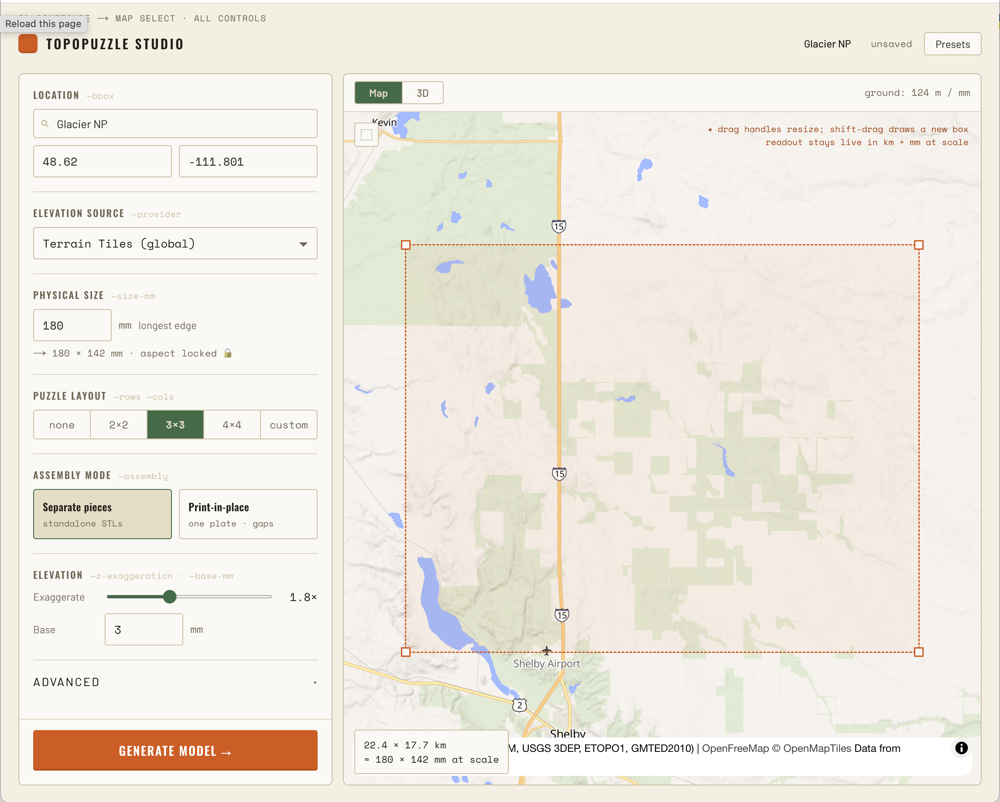
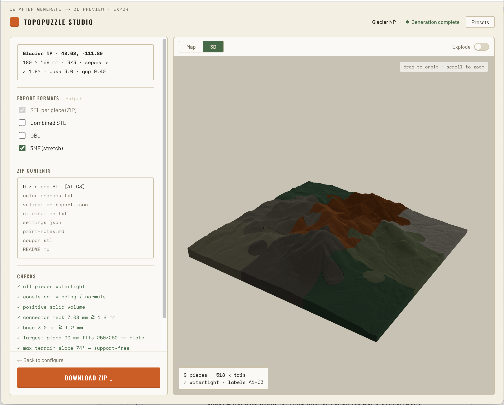

# TopoPuzzle Studio

Turn any place on Earth into a **3D-printable topographic terrain model** — optionally
split into an interlocking multi-piece puzzle — from real elevation data.

Pick an area on a map (or upload a GeoTIFF), set the physical size, choose a puzzle
layout and assembly mode, and export a ZIP of watertight STLs (plus 3MF, OBJ, a
calibration coupon, AMS color-change heights, an attribution manifest, and print
notes). Tuned for a **Bambu Lab P2S** (0.4 mm nozzle, ~250 × 250 mm usable plate).

>  &nbsp; 
> _(screenshot placeholders — run the app to capture)_

Everything runs **locally on Apple Silicon** with prebuilt arm64 wheels — no Docker,
no Homebrew GDAL build. MIT licensed; **generated models belong to you.**

---

## Quick start (macOS-native)

```bash
make setup        # creates .venv, installs Python core + API, and web deps
make dev          # API on :8000, web on :3000  →  open http://localhost:3000
```

Or drive it headless with the CLI (no web, no network — uses a local GeoTIFF):

```bash
source .venv/bin/activate
topopuzzle generate \
  --geotiff my-dem.tif \
  --rows 3 --cols 3 \
  --size-mm 180 --z-exaggeration 1.8 --base-mm 3 \
  --assembly separate-pieces --clearance-mm 0.20 \
  --output ./out/terrain-puzzle.zip

topopuzzle calibrate --clearance-mm 0.20 -o coupon.stl   # print this first
```

Try it with zero setup data using the committed synthetic examples:

```bash
make examples     # writes examples/*.zip from synthetic DEMs (ramp/hill/coastal)
```

## What you get in the ZIP

| file | purpose |
|------|---------|
| `A1.stl … C3.stl` | one **watertight** STL per piece (labels A1, B2, …) |
| `combined.stl` / `model.3mf` / `model.obj` | assembled reference; 3MF has named per-piece objects in **mm** |
| `coupon.stl` | tab/socket **calibration coupon** at your exact clearance — print first |
| `color-changes.txt` | exact **Z heights (mm)** for AMS filament changes per elevation band |
| `validation-report.json` | watertight / build-volume / overhang / min-feature checks |
| `attribution.txt` | elevation data source + license |
| `settings.json` | the exact, reproducible settings used |
| `print-notes.md` | Bambu Studio / PrusaSlicer guidance for this model |

## Repository layout

```
apps/web        Next.js + React Three Fiber front end (map select, 3D preview, export)
apps/api        FastAPI backend: background jobs, SSE progress, GLB preview, ZIP download
packages/mesh   Geometry core + providers + CLI  (installable: topopuzzle-mesh)
packages/shared Shared TypeScript types
examples        Committed example outputs from synthetic DEMs
tests           pytest suite (synthetic fixtures — no network)
docs            Print settings guide, provider notes, data attribution, roadmap
```

The heart of the tool is `packages/mesh` — it is fully tested and usable on its own.
See its [README](packages/mesh/README.md) for the module map.

## How it works (geometry pipeline)

1. **Fetch/load** a DEM (local GeoTIFF, or AWS/Mapzen terrain tiles).
2. **Reproject** the area to its local UTM zone so millimetre dimensions are true.
3. **Resample**, fill nodata gaps (reported), optional Gaussian smoothing and water
   flattening.
4. **Normalize** so the lowest terrain sits at the top of the base slab; apply
   vertical exaggeration.
5. **Build** a watertight heightfield solid (terrain top + flat bottom + walls).
6. **Split** into an interlocking grid puzzle with original parametric tab/socket
   connectors — as **separate pieces** (clearance fit) or **print-in-place** (one
   plate, straight-walled connectors, printable seam gap).
7. **Validate** every mesh independently (watertight, winding, build-volume,
   overhang, min feature) and **package** the ZIP.

## Assembly modes

- **Separate pieces** (default) — each piece its own watertight STL; connectors
  interlock with a per-side clearance (default 0.20 mm, 0.05–0.5 mm configurable).
- **Print-in-place** — pieces exported pre-assembled with a printable seam gap
  (default 0.4 mm ≥ nozzle width) so the whole puzzle prints as one plate and
  separates afterward. Connectors are straight-walled (no undercuts) so layers
  don't fuse; seams are visible and may need gentle flexing to free. **Print the
  calibration coupon first.**

## Data providers

| provider | key? | notes |
|----------|------|-------|
| Local GeoTIFF | — | fully offline MVP path |
| AWS/Mapzen Terrain Tiles | — | global online default; upstream sources: SRTM, 3DEP, ETOPO1, GMTED2010, … |
| USGS 3DEP, OpenTopography, OpenTopoData | later | see [docs/providers.md](docs/providers.md) |

Map tiles and elevation data are **separate concerns**. The map UI uses a
configurable tile style (`NEXT_PUBLIC_MAP_STYLE`) and never hardcodes public OSM
servers. Attribution is shown in the UI and written into every export.

## Docs

- [Print settings guide](docs/print-guide.md) — Bambu Studio first, PrusaSlicer second.
- [Provider notes](docs/providers.md) · [Data attribution](docs/attribution.md)
- [Roadmap](docs/roadmap.md) · [Troubleshooting](docs/troubleshooting.md)

## Optional: Docker

`docker compose up` builds the API + web images. Native `make dev` is the primary,
supported path; Docker is a convenience only.

## License

MIT — see [LICENSE](LICENSE). Generated models are yours. Respect the license of any
elevation/map data you use (recorded in each export's `attribution.txt`).
